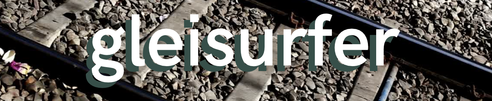

# gleisurfer

## What is it ?

Gleisurfer is an iOS app that helps the railway workers get a no-fuss clearance outline and anomalous object detection using augmented reality and machine learning.

## Why?

The clearance outlining on the railroad tracks are hard to do manually with bulky spatial calliper. Today smartphones are collecting way more data than we need! We can use state-of-the-art point cloud generation, 3D reconstruction and segmentation methods to  safely create the outline of the train clearance and detect if an object is not supposed to be there!

